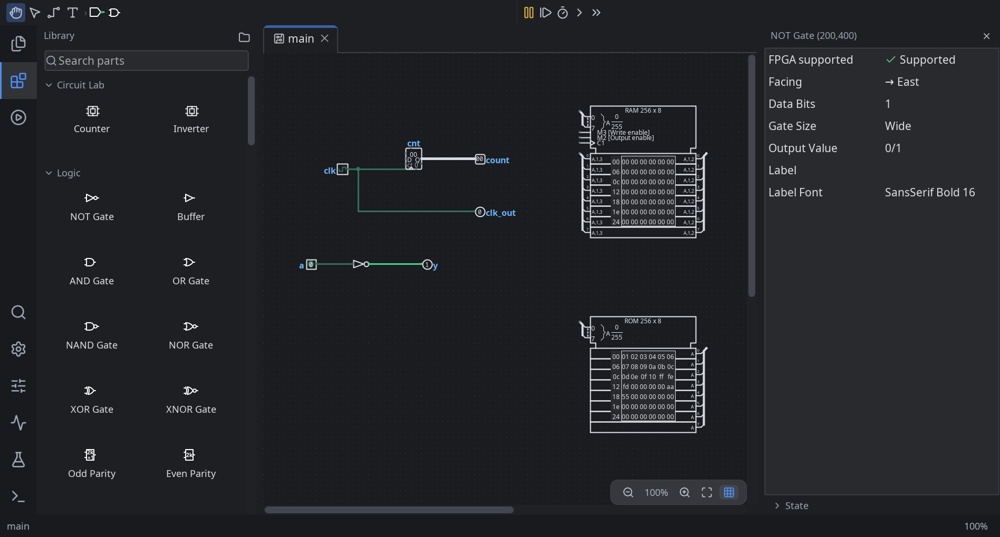
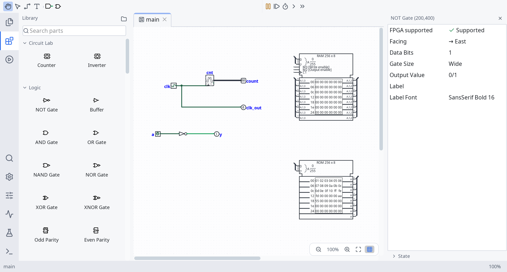

# Logisim Revolution

Design and simulate digital circuits in a local desktop app. Logisim Revolution combines a
searchable parts picker, a tabbed circuit editor, an inspector for component settings, and
built-in tools for testing and analyzing logic.

It is a fork of [Logisim-evolution](https://github.com/logisim-evolution/logisim-evolution).
It keeps the familiar circuit file format and component IDs while developing its own interface
and application identity.





## Install

Completed manual builds are published on the
[Gitea Releases page](https://git.briggen.dev/NilsBriggen/Logisim-Revolution/releases).
Choose the file for your operating system and CPU. A release appears only after all supported
native targets have built successfully; there may be no Revolution release yet.

| System | Download | Install or run |
| --- | --- | --- |
| Debian/Ubuntu, x86_64 or ARM64 | `.deb` | `sudo apt install ./logisim-revolution_*.deb` |
| Fedora/RHEL, x86_64 or ARM64 | `.rpm` | `sudo dnf install ./logisim-revolution-*.rpm` |
| Windows x86_64 | `.msi` | Open the installer and follow its prompts. |
| Windows x86_64, portable | `-windows-amd64.zip` | Extract the whole ZIP, then run `logisim-revolution.exe` inside it. |
| macOS Intel or Apple Silicon | `.dmg` | Open the disk image and copy Logisim Revolution to Applications. |

These native packages include a Java runtime. The development DMGs are not notarized, so macOS
may show a security warning on first launch. Snap and Flatpak files are not currently built or
published for Revolution.

### Portable JAR

The `-all.jar` release file runs on Linux, Windows, and macOS with **Java 21 or newer**.
Download it and run, for example:

```bash
java --enable-native-access=ALL-UNNAMED -jar logisim-revolution-5.1.0dev-all.jar
```

Use the actual downloaded filename when the version changes. The JAR does not include a Java runtime.
The `-src.jar` file contains source code; it is not the application launcher.

### Build from source

Install JDK 21 or newer, then use the included Gradle wrapper:

```bash
git clone https://git.briggen.dev/NilsBriggen/Logisim-Revolution.git
cd Logisim-Revolution
./gradlew run
```

On Windows, use `gradlew.bat run`. To build a portable JAR locally, run
`./gradlew shadowJar`; to build native packages for your current operating system, run
`./gradlew createAll` after installing its platform packaging tools. See the
[developer guide](docs/developers.md) and [Gitea runner setup](.gitea/README.md) for details.

## Make a first circuit

1. Choose **New** on the welcome screen. Use the parts picker search to find **Pin**, place two
   input pins, then add an **AND** gate and an **LED**.
2. Select the wiring tool and connect both pins to the gate inputs, then connect the gate output
   to the LED.
3. Use the poke tool to switch the inputs between 0 and 1. The LED lights when both inputs are 1.
4. Save your work as a `.circ` file. Select a component to change its settings in the inspector.

The [built-in help](src/main/resources/doc) and [project background](docs/docs.md) cover more
concepts and examples.

## What you can build

- Combinational and sequential circuits, from small gates to reusable subcircuits.
- Signals and displays, memory, arithmetic, TTL components, and SoC designs.
- Truth tables, expression analysis, test vectors, timing diagrams, and signal logs.
- VHDL components and HDL export; board and FPGA workflows where supported by your hardware
  and toolchain.

The editor follows the system light or dark theme by default. UI zoom can be changed
independently of circuit zoom.

## Files and settings

Revolution opens and saves the existing Logisim-evolution `.circ` format. Saved component and
library identifiers are unchanged. On the first interactive launch, Revolution offers to copy
compatible Evolution settings. Declining leaves Revolution on its own defaults. The two apps
keep separate settings and recovery files; importing does not delete or modify Evolution's
settings.

## Project and contributions

- [Source repository and bug reporting](https://git.briggen.dev/NilsBriggen/Logisim-Revolution)
- [Developer build and contribution notes](docs/developers.md)
- [Localization guide](docs/localization.md)
- [Full project credits](docs/credits.md)
- [License: GNU GPL version 3](LICENSE.md)

Logisim was created by Carl Burch. Logisim-evolution and its contributors developed the project
further; Revolution builds on that work. See the [credits](docs/credits.md) and source headers
for attribution. The new Revolution emblem and wordmark are included under the project's GPLv3
license.
