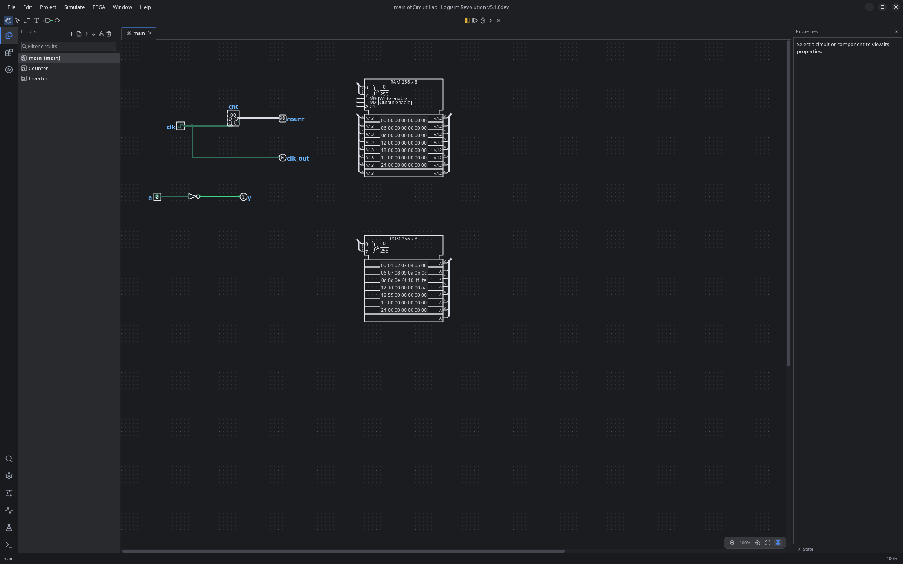
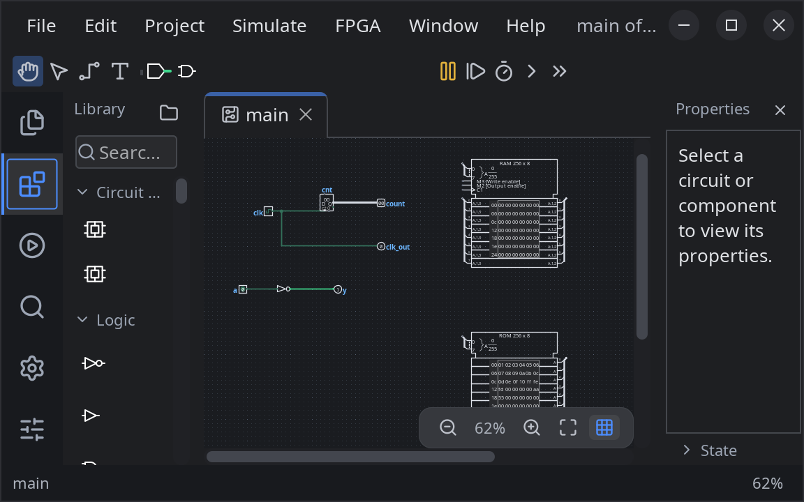
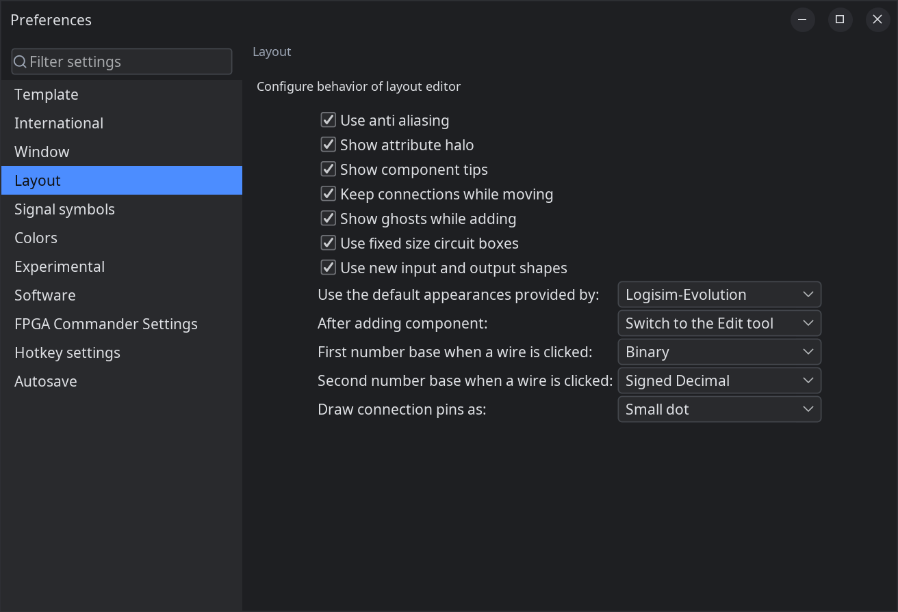
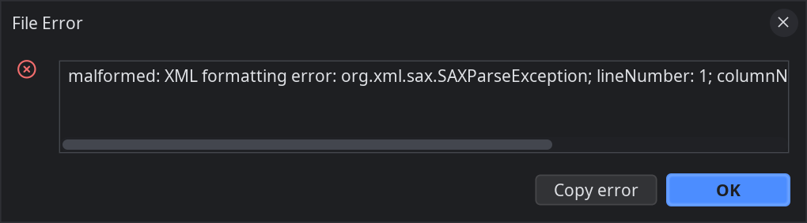
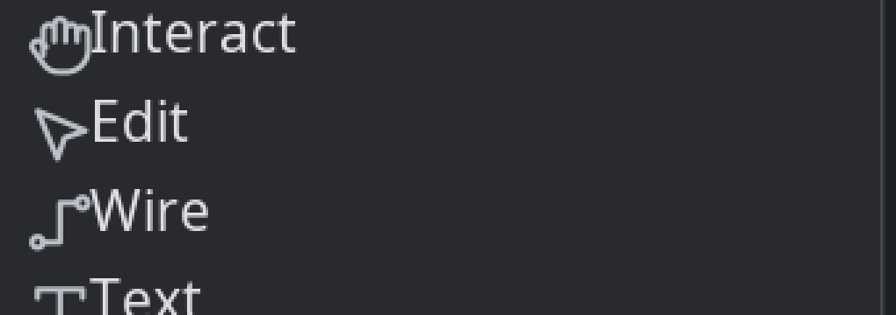

# Logisim-evolution improvement report (fresh audit, 2026-09-24)

Scope: the redesigned Java/Swing shell plus the whole product (load/save, canvas editing, simulation,
analysis, memory/I/O, HDL/FPGA, CLI, preferences, help), audited by a fresh multi-agent run against
the frozen `logisim-revolution 5.1.0dev` jar in an isolated KWin/Xwayland harness (private
`user.home`, private prefs, copied fixtures). Machine-readable register: [findings.json](findings.json).
Screenshots and logs cited below live in [evidence/](evidence/).

Update 2026-09-25: a follow-up visual-QA sweep (five inspectors: main shell, dialogs, scale matrix,
canvas components, design critique; dark and light themes; scales 1.0, 1.6 and 2.0; 1280x800 and
2560x1600 windows) replaced the failed visual agents of the first run. Each inspector report got a
skeptical screenshot review. Of 20 raw visual findings, 5 were refuted and 15 survive: 6 new
clusters (C216-C221) and 9 members merged into C149, C179, C165, C98, C110 and C199. The register now
has 221 clusters. Screenshots from the sweep are the `evidence/vis-*.png` files.

How to read verification tags:

- **reproduced**: an independent verifier re-ran the repro live (GUI or CLI) and saw the failure.
- **code-confirmed**: the mechanism was traced to specific source lines; not re-run live.
- **tester-observed**: one tester saw it live with a screenshot or log; no independent rerun.
- **visually confirmed**: a visual-sweep finding that the screenshot reviewer confirmed at the
  inspector's severity.
- **unverified**: claim rests on reasoning or a single ambiguous capture.
- **downgraded**: the skeptical reviewer lowered the severity; the original judge severity is kept in
  `findings.json` for traceability.

---

## 1. Executive summary

**Verdict: B- for the everyday build-and-simulate loop, D for file integrity and error handling.**
The redesigned shell is the strongest part of the product and clearly better than classic Logisim:
a coherent light/dark token system, activity rail, editor tabs, zoom pill, searchable preferences,
a Find Action palette, a clean close/quit contract (Escape/Cancel never discard), atomic saves, and
a test-vector panel that beats Digital's. Every persona finished their task except the keyboard-only
persona, who needed about 12 mouse actions (C28). But the audit found a
cluster of file-integrity and state-truthfulness defects, several of them reproduced, that let a
student lose work while the UI says everything is fine, plus a handful of silent-wrong-answer bugs
that an educational tool cannot afford. The fixes are almost all small and local.

Headline problems (all detailed in section 3):

1. **A recovered autosave loads as "clean"** (`isAutosaveLoaded()` has zero callers), so closing
   the window shows no prompt and deletes the autosave with it. The recovered edits are gone.
   Code-confirmed; tester-observed on disk. (C3, P0)
2. **Opening the Timing diagram while the clock ticks crashes the simulator** (NPE, `leftPanel`
   null, 3/3 reproductions) and pops "Simulator stopped: internal error, save your work". (C5, P0)
3. **Redo of a delete that contains a RAM throws an NPE mid-mutation** and leaves the circuit
   half-deleted with a clean title bar. Reproduced independently (same stack); the follow-on
   on-disk loss was seen by one tester but did not reproduce in the verifier's run. (C1, P0)
4. **The expression parser gives AND and OR the same precedence**: `a + b * c` becomes `(a+b)·c`,
   contradicting the app's own help page. Students learn wrong algebra. Code-confirmed. (C22, P1)
5. **Headless grading is untrustworthy**: `-tty` swallows every load error and prints a wrong
   truth table with exit 0; `-w` always exits 0 even with failed vectors. Code-confirmed and
   reproduced. (C12, C25, P1)
6. **Components the loader cannot parse are dropped, then permanently deleted on the next Save**
   with no dirty mark; one bad attribute value drops the whole component. Code-confirmed. (C2, P1)
7. **The dirty indicator cannot be trusted**: redo never sets the file dirty flag (autosave skips
   the redone work), Save As can target a file open in another window, and load rewrites labels
   (UUID suffixes, type-name labels stripped). Code-confirmed. (C4, C7, C9, C10, P1-P2)
8. **Error states are vivid but inert**: the width banner is painted text, tunnels with mismatched
   widths show locally consistent badges, wires have no tooltip, raw Java exceptions reach dialogs.
   (C32, C33, C149, P2-P3)

What is genuinely good: the core loop (place from toolbar, drag wires with auto-junctions, poke,
save) worked in ~42 actions for a novice and produced a correct half adder; hierarchy with
breadcrumb navigation and per-instance simulation states; truth-table keyboard entry (16 rows in 16
keystrokes) and correct K-map minimisation; Build Circuit with a safe default name, named Replace
button and undo; test vectors loading in 4 steps with Show/Set; a hex-image format dialog with
per-line errors; DRC double-click-to-component; merge conflict dialog with Rename; five-format
image export with batch mode; hardened XML parsing (DOCTYPE/XXE rejected); clean close/quit
prompts; live theme/scale/language switching with zero exceptions; and empty app logs across most
sessions.

**Visual sweep (2026-09-25).** A screenshot-based pass across themes, scales and secondary windows
found no new P0 or P1. The dark shell is clean and coherent at 1.6 on a large window
([vis-shell-1.6-large.png](evidence/vis-shell-1.6-large.png)). Preferences and Project Options share
one filterable two-pane pattern, and the file chooser and Analyzer use the same chrome. Several
contrast claims did not survive re-sampling: the dark title text is about 9.5:1, not 1.95:1; the
colour swatches have borders; secondary grey is about 6.5:1. RAM/ROM contents are now legible in the
dark theme. The surviving defects are layout-level. The worst is **C219 (P2)**: at 2.0x in a
1280x800 window the parts picker drops every component name. **C149** was raised to P2 because a
corrupt file produces two stacked dialogs of raw Java exceptions. Settings forms use at least three
alignments (C179), and the FPGA settings page is still the legacy layout (C165). The rest is polish:
memory-symbol density, a flat type scale, and property-label truncation (C216-C221).

---

## 2. Scorecard

Three judges scored independently (0-10). Numbers are theirs; the reviewer's downgrades of
individual findings do not change these. The "After visual sweep" column changes a score only where
the 2026-09-25 screenshot evidence contradicts the judges' basis; blank means unchanged.

| Lens | Dimension | Score | After visual sweep |
|---|---|---|---|
| Heuristics | H1 Visibility of system status | 5 |  |
| Heuristics | H2 Match with real world | 5 |  |
| Heuristics | H3 User control and freedom | 4 |  |
| Heuristics | H4 Consistency and standards | 4 |  |
| Heuristics | H5 Error prevention | 3 |  |
| Heuristics | H6 Recognition over recall | 6 |  |
| Heuristics | H7 Flexibility and efficiency | 5 |  |
| Heuristics | H8 Aesthetic and minimalist design | 6 |  |
| Heuristics | H9 Recognise, diagnose, recover from errors | 3 |  |
| Heuristics | H10 Help and documentation | 5 |  |
| Heuristics | Data integrity (error prevention/recovery) | 2 |  |
| Heuristics | Workflow efficiency | 5 |  |
| Visual design | Shell chrome | 7 | 7 (confirmed) |
| Visual design | Canvas and component rendering | 4 |  |
| Visual design | Colour system and theming | 5 | 5 (confirmed) |
| Visual design | Typography and density | 5 |  |
| Visual design | Iconography | 4 |  |
| Visual design | Consistency across windows | 3 | 4 |
| Visual design | Polish and HiDPI | 4 | 4 (confirmed) |
| Visual design | Modernity vs peers (Digital, CircuitVerse, KiCad) | 5 |  |
| Learnability | Onboarding / first run | 4 |  |
| Learnability | Discoverability | 5 |  |
| Learnability | Feedback while simulating | 6 |  |
| Learnability | Error explanation | 3 |  |
| Learnability | Help / documentation | 5 |  |
| Learnability | Correctness students can trust | 4 |  |
| Learnability | Instructor workflows | 5 |  |
| Learnability | Power-user ceiling | 7 |  |

Aggregate: heuristics mean 4.4, visual mean 4.6 (4.8 after the visual sweep), learnability mean
4.9. The lowest scores (data integrity 2; error prevention, error diagnosis/recovery and error
explanation at 3) point at the same two root themes: state truthfulness and inert error UI.

What the visual sweep changed, and why:

- **Consistency across windows 3 -> 4.** The judges scored 3 from incidental captures. The sweep
  inspected all 11 Preferences pages, all 3 Project Options pages, the file chooser, the load-error
  flow and three Analyzer tabs. They share one chrome, one two-pane filterable settings pattern and
  one dark palette ([vis-prefs-layout.png](evidence/vis-prefs-layout.png),
  [vis-analyzer.png](evidence/vis-analyzer.png)). The remaining inconsistency is alignment inside
  forms (C179, C218) and one legacy page (C165), not separate visual systems. It is not higher
  because the Analyzer sizing, FPGA commander and pickers (C74, C85, C175) were not re-inspected.
- **Shell chrome 7, Polish and HiDPI 4, Colour system 5: confirmed, not changed.** The shell is clean
  at 1.6 on a large window, but HiDPI degrades at 2.0 in a small window (C219, C98). Three contrast
  claims were refuted, but the dark-theme canvas defaults (C68) were not re-checked, so the colour
  score stays.
- Canvas and component rendering stays at 4: RAM/ROM contents are now legible, but the memory symbols
  are dense at 100% (C217) and the rest of the component catalogue was not swept.

Caveat on the scores: the judges' "8+ confirmed data-loss paths" statement is stronger than the
skeptical review supports. After review, the paths with reproduced or code-confirmed loss are C3
(autosave), C2 (dropped components on save), C7 (Save As clobber), C8 (assembler buffer), C9/C10
(label rewrites), C37 (Latin-1 legacy). C1's on-disk loss did not reproduce independently, and C4
and C6 lose no content. The scorecard is therefore somewhat harsh on H1/H5 but not wrong in kind.

---

## 3. Prioritised findings

P0 = data loss, crash, or blocked core workflow. P1 = wrong results or loss in a common path.
P2 = real defect, workaround exists. P3 = polish, copy, enhancement. Effort S <= half a day,
M <= 3 days, L <= 2 weeks, XL longer. Prior-audit tag per section 8.

### Theme A: file integrity and state truthfulness

**C3 · P0 · Recovered autosave is not marked dirty; closing deletes it** (new)
Repro: edit, wait for `.x.circ.revolution.autosave`, `kill -9`, relaunch, choose Load in "Autosave
found", then Ctrl+Shift+W. No prompt; the autosave is deleted; the edit is gone from disk.
Evidence: [autosave-recovered-clean.png](evidence/autosave-recovered-clean.png) (recovered circuit
`probe_two` listed, title has no dirty marker).
Root cause: `LogisimFile.java:304` sets `autosaveLoaded`; `isAutosaveLoaded()` (line 818) has no
callers. `Frame.confirmClose` uses `project.isFileDirty()` (undoMods==0 after load), and
`Frame.dispose()` -> `stopAutosaveThread(true)` deletes the autosave.
Fix: after an autosave load call `setForcedDirty()` (or push a "Recovered from autosave" action)
and keep the autosave until an explicit Save or Discard. Show a "recovered, not yet saved" banner.
Effort S. Verification: code-confirmed + tester-observed on disk. Reviewer downgraded critical->high;
kept P0 here because the whole point of autosave is this path.

**C1 · P0 · NPE in `Ram.removeComponent` during Redo leaves the circuit half-mutated and "clean"** (new)
Repro: ui-smoke.circ, Ctrl+E (auto-propagate off), Ctrl+A, Delete, Ctrl+Z, Ctrl+Shift+Z. With
auto-propagate on it also fires when redo follows undo within ~30 ms (undo/redo storms).
Evidence: [ram-npe-half-deleted.png](evidence/ram-npe-half-deleted.png) (ghost selection boxes,
clean title), [ram-npe-verify-repro.png](evidence/ram-npe-verify-repro.png),
[ram-npe-verify.log](evidence/ram-npe-verify.log) (identical stack in the independent rerun).
Root cause: `Ram.java:395` passes `state.getData(c)` (null before any propagation) to
`closeHexFrame`, which dereferences it at `:162`. `Circuit.mutatorRemove` (`Circuit.java:917-936`)
calls the factory hook after `comps.remove(c)` with no rollback, so the mutation aborts part-way.
`Project.redoAction` does not mark the file dirty (see C4).
Fix: null-guard in `Ram.removeComponent`/`closeHexFrame`; wrap factory hooks in `mutatorRemove`
with try/catch-and-log; mark dirty or roll back when an action throws; add a JUnit test (add RAM,
remove without propagating). Effort S.
Verification: **reproduced** (crash, exact stack). The claimed on-disk loss ("saved main keeps only
Counter + 4 wires") is tester-observed only; the verifier's save was byte-identical to the fixture.

**C2 · P1 · Unparseable components are dropped at load and deleted from disk on Save** (new)
Repro: `.circ` with `<comp name="FrobnicatorXYZ"/>` and a Pin `width="banana"`; OK the File Error
dialog; Ctrl+S; both elements are gone. Evidence: [load-error-dialog.png](evidence/load-error-dialog.png).
Root cause: `XmlReader.initAttributeSet` (`:182-193`) throws `XmlReaderException` on any
`NumberFormatException`, and `XmlCircuitReader` (`:75-117`) skips the element; nothing preserves
the raw XML and the project is not dirtied.
Fix: fall back to the attribute default and record a warning; keep unknown elements as opaque XML
re-emitted by `XmlWriter`; at minimum mark dirty and confirm before overwriting a file that loaded
with errors. Effort M. Verification: code-confirmed. Downgraded critical->high: the load dialog is
loud, only the later save is unwarned.

**C7 · P2 · Save As onto a file open in another window; that window later clobbers it** (new)
Repro: window A has work2.circ; window B (Untitled + circuit `clobber`) Save As work2.circ, Yes on
overwrite; edit A, Ctrl+S: `clobber` is gone, B still shows clean.
Evidence: [saveas-clobber-window.png](evidence/saveas-clobber-window.png).
Root cause: `ProjectActions.doSaveAs` (`:806`) checks only `exists()`; `doOpen` already uses
`Projects.findProjectFor`. Fix: refuse or warn when another project owns the target. Effort S.
Verification: code-confirmed + tester-observed.

**C4 · P2 · Redo never updates the file dirty flag; tab dot and title disagree** (new)
Repro: Select All, Duplicate, undo to clean, redo all: content modified, title clean, autosave
skips it. Evidence: [redo-clean-title.png](evidence/redo-clean-title.png).
Root cause: `Project.redoAction` (`Project.java:442-468`) does `++undoMods` but never calls
`file.setDirty(isFileDirty())`, unlike `doAction`/`undoAction`. Close prompts still work because
they read `isFileDirty()`. Fix: call `file.setDirty` after redo; only `++undoMods` when
`isModification()`; drive the tab dot from the same flag. Effort S. Verification: code-confirmed;
downgraded critical->medium (no loss, autosave gap only).

**C6 · P2 · Save resets mode to 0600, replaces symlinks, overwrites read-only files** (new)
Root cause: `Loader.java:553` `Files.createTempFile` (0600) then `:567-575` `Files.move(ATOMIC_MOVE,
REPLACE_EXISTING)` onto the path itself. Fix: `toRealPath()`, `Files.isWritable` check with a Save As
offer, copy `PosixFilePermissions`/owner onto the staged file. Effort S. Verification:
code-confirmed + tester-observed (`stat` before/after). Downgraded high->medium: metadata only, but
it breaks shared lab folders.

**C9 · P2 · Load strips labels that equal a component type name, with three info-icon "Message" modals** (new)
Evidence: [label-strip-dialogs.png](evidence/label-strip-dialogs.png). Root cause:
`Circuit.mutatorAdd` -> `removeWrongLabels` (`Circuit.java:896, 940-960`) runs on the
`XmlCircuitReader` path, matches case-insensitively, deletes the label, and shows a parentless
INFO dialog per clash (also in `-tty`). Fix: skip during load; validate once afterwards; rename
(`led_1`) rather than delete; one warning dialog with the real labels. Effort S.
Verification: code-confirmed + tester-observed on disk.

**C10 · P2 · VHDL-invalid labels ("café", "my out") get a random UUID suffix on load** (still-open:
prior `components-13`, confirmed-source, W1). Root cause: `XmlReader.ensureLogisimCompatibility`
runs for every file version (`:650-657`, called at `:1152`) and `generateValidVHDLLabel` (`:739`)
appends `UUID.randomUUID()`; tunnels included though the interactive validator exempts them.
Fix: limit to old file versions, skip Tunnel/Text, deterministic suffix, tell the user. Effort S.
Verification: code-confirmed. Note the rewrite is stable after the first load (the new label is
valid), so test-vector column names break once, not every time.

**C11 · P2 · Autosave serialises the live circuit off-EDT with no lock; any RuntimeException kills
autosave silently for the session** (new)
`LogisimFile.java:93-110`, `XmlWriter.java:280-296` iterate `getNonWires()` while the EDT mutates
it; only `IOException` is caught and a single failure sets `run=false`. Fix: snapshot to bytes on
the EDT or under circuit locks; catch `RuntimeException`, report, keep retrying. Effort M.
Verification: code-confirmed, not reproduced.

**C8 · P2 · SoC assembler buffer lost on quit/close; cancelling its save wipes it** (new)
`AssemblerPanel.java:356-372` prompts in `windowClosed` (Yes/No only) and clears unconditionally;
save uses `showOpenDialog`; `doQuit` ignores assembler buffers. Fix: `windowClosing` with
Save/Discard/Cancel, include buffers in quit/close checks, `showSaveDialog`. Effort S.
Verification: code-confirmed + tester-observed.

**C37 · P3 · Latin-1 fallback for pre-2.5.1 files decodes as UTF-8 on JDK 18+ (U+FFFD saved)** (new)
`LogisimFile.java:289` `new FileReader(loadFile)`. Fix: pass `StandardCharsets.ISO_8859_1`. Effort S.
Verification: code-confirmed + tester-observed. Very rare input.

**C38 · P3 · Save overwrites external changes without an mtime check** (new). `Loader` has no
`lastModified` handling. Fix: record mtime at load/save and prompt. Effort S. Code-confirmed.

**C36 · P3 · Any exception while creating a window calls `System.exit(-1)`** (new).
`ProjectActions.java:84-100`. Fix: exit only if no other project is open. Effort S. Code-confirmed;
no trigger demonstrated.

**C46 · P2 · Leftover autosave makes `-tty` fail with a generic error; corrupt autosave blocks GUI
open and blames the real file** (new). `LogisimFile.load:257-264` returns null on `CLOSED_OPTION`
(what a headless prompt yields). Fix: skip the autosave check when `!Main.hasGui()`; fall back to
the original on parse failure. Effort S. Verification: code-confirmed + CLI output.

**C13 · P2 · Self-/mutually-recursive subcircuit file: StackOverflowError, no window, lingering
JVM** (new). `SimulationTreeCircuitNode.java:45,110` recurse unbounded; the loader has no cycle
check (the editor does). Fix: DFS cycle check after load, reject with a message; make the tree
cycle-safe. Effort S. Verification: tester-observed (two logs). Rare, hand-crafted input.

### Theme B: crashes and threading

**C5 · P0 · Opening the Timing diagram while ticking crashes the simulator** (new)
Repro: any circuit with a Clock, Ctrl+K, click the Timing rail icon (3/3).
Evidence: [timing-npe-canvas.png](evidence/timing-npe-canvas.png),
[timing-sim-stopped.png](evidence/timing-sim-stopped.png), [timing-npe.log](evidence/timing-npe.log).
Root cause: `ChronoPanel` constructor calls `setModel()` -> `model.addModelListener(this)` before
`configure()` creates `leftPanel`/`rightPanel`; `SimThread` fires `signalsExtended`
(`ChronoPanel.java:274`) in that window, and `SimThread.run`'s `catch(Throwable)` stops the
simulation. Fix: register after `configure()`, null-guard, and marshal `signalsExtended`/
`signalsReset` to the EDT with coalescing (see C20). Effort S for the guard, M for the EDT work.
Verification: tester-observed 3/3 with logs; not independently re-run. Downgraded critical->high
(no data loss); kept P0 because it blocks a core feature in its most natural use.

**C20 · P2 · Log `Model` and chronogram Swing components mutated across SimThread and EDT** (new)
`Model.signals` is a plain `ArrayList` iterated on SimThread (`Model.java:636-655`) and edited on
the EDT (`:250-300`); `ChronoPanel.signalsExtended` (`:273-282`) and `RightPanel.updateSize`
(`:200-217`) resize/revalidate on SimThread. C5 and C21 are concrete instances. Fix: sample on
SimThread into an immutable batch, apply on the EDT via one coalesced `invokeLater`. Effort M.
Code-confirmed.

**C21 · P2 · IndexOutOfBoundsException on simulation-state switch leaves the timing diagram on the
wrong circuit with mislabelled signals** (new). `RightPanel.updateSelected:301` indexes a stale
selection. Evidence: [timing-ioobe.log](evidence/timing-ioobe.log). Fix: clear selection before
swapping models; clamp. Effort S. Tester-observed with log.

**C41 · P3 · Deleting all timing rows leaves a stale spotlight -> IOOBE on mouse move** (new).
`Model.remove:262` `items.contains(spotlight)` compares `SignalInfo` with `Signal` (the
`@SuppressWarnings("unlikely-arg-type")` is the tell). Fix: compare signals, bounds-check. Effort S.
Code-confirmed + log.

**C18 · P2 · Closed project windows are never garbage-collected** (new)
After opening/closing 5 windows + GC: 6 Frame/Project/Simulator instances remain. Root cause:
`LocaleManager` (`:91-126`) keeps a static strong listener list and `removeLocaleListener` is never
called; Frame, Canvas, Toolbox, AttrTable, LogFrame, HexFrame all register. Fix: unregister in
`dispose()` or hold weakly / tie to displayability like `Theme.addListener(owner, ...)`. Effort S.
Verification: **reproduced** (jcmd histogram).

**C19 · P2 · A malformed user template is accepted; every File > New then throws NPE** (new)
`TemplateOptions.java:150-158` ignores `LogisimFile.load()` returning null and sets
`TEMPLATE_CUSTOM`; `createNewFile` falls back only on `IOException`. Fix: commit the template only
when it loads; treat null like `IOException`. Effort S. Verification: **reproduced** (live) and
code-confirmed.

**C35 · P2 · JAR with no manifest -> uncaught NPE on the EDT, user sees nothing** (new)
`ProjectLibraryActions.java:110` (and `LogisimFileActions.java:281`) dereference a null manifest.
Evidence: [jar-npe.log](evidence/jar-npe.log). Fix: null-check so the class-name prompt appears.
Effort S. **Reproduced** + code-confirmed.

**C16 · P2 · Merging a file that uses a built-in library prompts "Locate TTL"; Cancel throws
LoaderException** (new). `LogisimFileActions.java:139-144` calls `getFileFor` for `#TTL`-style
descriptors; `doMerge` does not catch. Evidence: [merge-loaderexception.log](evidence/merge-loaderexception.log).
Fix: auto-add built-ins; prompt only for file/jar descriptors. Effort S. Tester-observed + log.

**C14 · P2 · A placed VHDL entity without QuestaSim stops the whole circuit; `-tty` exits 255** (new)
`VhdlEntity.java:236-251` drives outputs UNKNOWN then throws `UnsupportedOperationException`;
`SimThread` treats it as fatal. Evidence: [vhdl-entity-throws.log](evidence/vhdl-entity-throws.log).
Fix: return without throwing, show a non-fatal badge. Effort S. Code-confirmed (long-standing
upstream behaviour, but it makes an unrelated NOT gate show wrong values).

**C40 · P2 · TikZ/SVG export stops part-way with an NPE (classic Register, Random, Telnet)** (new)
`TikZInfo.getColorName:136` dereferences a null `LABEL_COLOR`. Evidence:
[tikz-npe.log](evidence/tikz-npe.log). Fix: make `setColor(null)` a no-op; default colour in those
painters; catch per circuit and report. Effort S. Confirmed by log + code.

**C15 · P2 · Unconnected ROM crashes HDL generation with a raw NPE, not logged** (new)
`Hdl.getBusName` returns null -> `RomHdlGeneratorFactory` -> `LineBuffer.applyPairs`.
Evidence: [hdl-rom-npe.png](evidence/hdl-rom-npe.png). Fix: null-check, make it a DRC error, log
stack traces in `reportDownloadFailure`. Effort S. Tester-observed (GUI + headless).

**C26 · P3 · A 400k-row test-vector file freezes the UI for minutes** (new). `gui/test/Model.setResult`
posts one `invokeLater(updateSortedIndices)` per row, O(N^2 log N) on the EDT. Fix: coalesce on a
timer, sort once at the end. Effort S. jstack-confirmed; only under stress input.

**C17 · P3 · Export Image allocates a full raster even for SVG/TikZ; OOM/IAE on huge extents, silent**
(new). `ExportImage.java:246-251`. Fix: allocate only for raster, bound size, catch and report.
Effort S. Log-confirmed; contrived input.

**C43 · P2 · `-tty` cannot load any SoC circuit without a display** (new). `SocBusStateInfo extends
JDialog`, built in `registerComponent`. Fix: lazy dialog / skip when headless. Effort S. Confirmed.

**C42 · P3 · Analyzer bus variable `b[31..0]` throws IllegalArgumentException** (new).
`VariableTab.ok` off-by-one (`w -= 1`, `:626`), unbounded combo index; `VariableList.add` counts
variables not bits. Effort S. Log-confirmed.

**C99, C201, C202, C203, C206 · P3 · Assorted off-EDT Swing updates and races** (AssemblyWindow
static state + leaked listener; MenuSimulate reset on SimThread + 500 ms EDT sleep; Startup on the
main thread; macOS open-file list; TestPanel fields nulled on the EDT). Code-confirmed, none
reproduced. Fix as a batch under the C20 marshalling work. Effort M total.

### Theme C: silent wrong answers

**C22 · P1 · Parser gives `+` and `*` equal precedence; `&`, `|`, `^`, `xor` each differ** (new)
Repro: Expression tab, `a + b * c` -> `(a+b)·c`. Evidence: [parser-precedence.png](evidence/parser-precedence.png).
Root cause: `Parser.java:188-196, 344-381` assigns `LOGIC_PRECEDENCE` to both `+` and `*`,
`BITAND` (lower than `+`) to `&`, `PYTHON_*` to word forms, `OPLUS` to `^`. The help
(`ana-expr.html:55-100`) documents NOT > AND > XOR > OR. Fix: one precedence table for all
spellings, parser unit tests keyed to the help table, update the page (also remove the Enter/Clear/
Revert button text). Effort S. Verification: code-confirmed and tester-observed.

**C12 · P1 · `-tty` swallows load errors: wrong truth table, exit 0** (new)
Evidence: [tty-badattr.out](evidence/tty-badattr.out) (`a y / 0 U / 1 U`, nothing on stderr).
Root cause: `OptionPane.showOptionDialog` (`:335-346`) returns `CLOSED_OPTION` silently when
`!Main.hasGui()`; `Loader.showError` goes through it; `TtyInterface` never inspects load messages.
Fix: print to stderr when headless; exit non-zero when the loader reported errors. Effort S.
Code-confirmed + CLI output. Also covers C134 (oscillation printed as `E`, exit 0), C180 (load
failure prints no reason; reproduced), C52 (`1 << inputCount` overflow at 31+ bits), C49 (`--load`
image discarded on any warning but reports success), C51 (`halt` with no halt pin loops forever),
C50 (stdin flood OOM / EOF spin), C189 (`-l` swallows the circuit filename; reproduced), C181 (`-n`
needs a display; reproduced), C191 (normal halt logged at ERROR). Fix these together as one
"headless contract" pass: every CLI mode prints its cause to stderr and returns a documented exit
code. Effort M for the set.

**C25 · P1 · `--test-vector` always exits 0** (new)
Evidence: [tv-exit0.out](evidence/tv-exit0.out) (`Failed: 2`, rc 0). Root cause: `Startup.java:1070`
discards the `doTestVector` result; `:1127` exits 0. Fix: exit 1 on failures, 2 on load errors;
allow headless. Effort S. Code-confirmed + CLI.

**C53 · P2 · Pin "Label Location" is shown, saved, and ignored** (new)
Evidence: [pin-labelloc-ignored.png](evidence/pin-labelloc-ignored.png). `Pin.java:753-767, 823-838`
always use `pinLabelLoc(facing)`; `instanceAttributeChanged` ignores `LABEL_LOC` although an
Alt+arrow configurator is installed for it. Fix: honour it or hide it. Effort S. Code-confirmed.

**C62 · P2 · A multi-bit net with only one width-setting port draws as a thin wire** (new)
Evidence: [thin-bus-wire.png](evidence/thin-bus-wire.png). `WireBundle.setWidth` (`:77-98`) sets
`isBus_` only in the equal-width branch; the first assignment never sets it, which also suppresses
the bus-width label. Fix: set on first assignment; unit test. Effort S. Code-confirmed.

**C72 · P2 · Circuit with a width mismatch is analysed silently as all don't-care** (new)
Evidence: [analyzer-width-mismatch.png](evidence/analyzer-width-mismatch.png). Neither `Analyze.java`
nor `ProjectCircuitActions` checks `getWidthIncompatibilityData`. Fix: raise the existing
`AnalyzeException` and name the net. Effort S. Tester-observed.

**C75 · P2 · First click on an unselected DIP switch only selects it** (new)
Evidence: [dip-first-click.png](evidence/dip-first-click.png). Reviewer traced a double dispatch:
`InstancePokerAdapter.getPokeCaret` calls `mousePressed` (`:92`) and `PokeTool.mousePressed` calls
it again (`:256-258`); `DipSwitch.Poker` toggles in `mousePressed`, so the first click toggles
twice. Pin is unaffected because it acts on release. Fix in the dispatch, not in DipSwitch. Effort S.
Code-confirmed.

**C44 · P2 · Validating an edited VHDL entity does not update placed instances** (new)
Evidence: [vhdl-stale-ports.png](evidence/vhdl-stale-ports.png). `VhdlEntity.contentSet` (`:324-326`)
only refreshes the icon; `updatePorts` runs only from `appearanceChanged`. Fix: loop `myInstances`
and `updatePorts` + `fireInvalidated`. Effort S. Code-confirmed.

**C154 · P3 · Non-printer-view export shows values that were never simulated** (new)
Evidence: [export-false-values.png](evidence/export-false-values.png) (NOT gate 0->0). Fix:
propagate a temporary state or fall back to printer view. Effort S. Tester-observed.

**C188 · P3 · Deep nesting at/above the oscillation limit is reported as oscillation** (new).
**Reproduced** (deep110_lim100 -> E; removing the chain -> 0/1). Root cause unverified (lazy substate
steps counted). Effort M. Rare.

**C137, C190 · P3 · Vectors that omit inputs run silently; header-only / duplicate-column files pass
vacuously** (new). `TestVector.parseHeader:213-266` validates neither. Effort S. Code-confirmed.

### Theme D: error explanation and diagnosability

**C33 · P2 (reviewer: low) · Error states are not actionable** (new)
Evidence: [width-banner.png](evidence/width-banner.png). `Canvas.java:313-325` paints "Incompatible
widths" as inert text; wires have no `ToolTipMaker`; nothing links to the wire-colours help page.
Reviewer classes this as an enhancement; all three judges rank it as the top learnability gap. Fix:
a clickable problems chip (count, next/prev, select-and-scroll to `getPoint(0)`), wire hover
tooltips (width, value, conflicting widths), a status-bar legend with a "Learn more" link.
Effort M. Verification: tester-observed.

**C32 · P2 (reviewer: low) · Width mismatch through same-named tunnels shows locally consistent badges**
(new). Evidence: [tunnel-width-mismatch.png](evidence/tunnel-width-mismatch.png) (8/8 on one side,
4/4 on the other). Fix: badge tunnels with the partner width (`8!=4`); highlight partner tunnels on
select/hover. Effort S. Tester-observed.

**C149 · P2 · A corrupt file produces two stacked dialogs of raw Java exceptions; an empty
`<project/>` NPEs on `lastLibElt`** (new; raised from P3 by the visual sweep). Opening a `.circ` of
plain text shows "File Error" with `org.xml.sax.SAXParseException; lineNumber: 1; columnN...` cut
off behind a horizontal scrollbar, then a second "Error During Open" dialog with
`com.cburch.logisim.file.LoadFailedException`: two dismissals for one failure, both showing Java
internals. Evidence: [vis-load-error-1.png](evidence/vis-load-error-1.png),
[vis-load-error-2.png](evidence/vis-load-error-2.png),
[load-raw-exception.png](evidence/load-raw-exception.png). `LogisimFile.java:293-294`
(`firstExcept.toString()`), `XmlReader.java:~1283`. Fix: one dialog per failed open with a plain
sentence ("not a valid Logisim project: malformed XML at line 1"), wrapped text, the raw exception
behind the existing Copy error button or a Details expander; guard the root element. Effort S.
Verification: code + screenshot; **visually confirmed**. Skeptic: medium (inspector said high; it
only happens with corrupt files).

**C63 · P3 · Only the last error's off-screen arrow is drawn** (new). `Canvas.computeViewportContents`
calls `setArrows` per exception and `setArrows` starts with `clearArrows()` (`:320-324, 649-652`).
Fix: clear once before the loop. Effort S. Code-confirmed.

**C47 · P3 · If the file passed at startup cannot be opened, the app exits after one error** (new).
`Startup.java:1106` `System.exit(-1)` when `numOpened == 0`. Fix: fall back to the welcome screen.
Effort S. Code-confirmed.

**C48 · P3 · Missing library prompts twice, then "XML formatting error"; headless throws
HeadlessException** (new). `Loader.getFileFor:239-259` opens a chooser unconditionally;
`LogisimFile.load` catches and retries. Effort S. CLI half confirmed.

**C70 · P3 · After oscillation the status bar says "no signals changed", "1 input changes"** (new).
Evidence: [osc-status.png](evidence/osc-status.png). Fix: "Stopped: oscillation" + Reset hint; fix
the plural. Effort S.

**C64 · P3 · Wire inspector shows no width/value** (new). Feature request; Poke already shows the
value. Effort S.

**C127 · P3 · No warning while dragging a wire into a width conflict** (new). Enhancement. Effort M.

### Theme E: editing, undo and inspector

**C39 · P3 · Analyzer has no undo; re-analysing or importing replaces a hand-made table** (still-open:
prior `analyzer-07`, confirmed-source, W7). Fix: confirm before replacing a changed model; analyzer
undo stack; K-map editing hint. Effort M.

**C76 · P2 · Hex editor's own Ctrl+Z does nothing; its Edit menu is the full circuit menu** (new)
Evidence: [hex-editor.png](evidence/hex-editor.png). `HexFrame.EditListener.register` (`:199-205`)
wires only cut/copy/paste/delete/select-all. Fix: route undo/redo to the project. Effort S.
Code-confirmed.

**C77 · P3 · Typing hex digits does not advance the cell** (new). `Caret.keyTyped:267-307` shifts
digits in; only Space/Enter move. Designed behaviour for wide words; auto-advance after a full cell
plus a hint would help. Effort S.

**C107 · P3 · Repeated paste/duplicate stacks copies at one offset (hidden conflicting drivers)** (new).
Fix: cascade past the selection bounds. Effort S.

**C166 · P3 · Repeated arrow presses add no-op reface undo entries** (new). `EditTool.attemptReface`
(`:131-148`) never compares with the current facing; `SetAttributeAction.isEmpty` only checks list
emptiness. Effort S. Code-confirmed.

**C135 · P3 · Tick-frequency change dirties the project with nothing to undo** (new).
`Circuit.java:999-1004` `setForcedDirty`. Effort S.

**C109 · P3 · Cancelling the export-bundle README dialog leaves no active tool** (new).
`ProjectActions.java:721` returns without `setTool(oldTool)`. Fix: try/finally. Effort S. Code-confirmed.

**C57 · P3 · Properties header keeps the last layout selection in the appearance editor** (new).
Evidence: [appearance-stale-header.png](evidence/appearance-stale-header.png). `Frame.java:1150-1152`
only updates the title on `setAttrTableModel`. Effort S.

**C170 · P3 · Properties keeps "Various items x 4" after the selection is dropped** (new). Effort S.

**C220 · P3 · Properties labels and values truncate even at 1.0x** (still-open: prior `light-03`).
"Data bus implement...", "Simulation reset be...", "Clear contents on re..." for a RAM in a 1280-wide
window. Evidence: [vis-props-trunc-1x.png](evidence/vis-props-trunc-1x.png). Fix: wrap labels to two
lines or widen the label column, full text in a tooltip. Effort S. Visually confirmed, low (the panel
is resizable).

**C216 · P3 · With the Hand tool active and nothing selected, Properties shows only a hint**
(still-open, narrowed: prior `inspector-10`, which had no hint at all). Evidence:
[vis-props-empty.png](evidence/vis-props-empty.png). The hint is intentional (`propertiesEmptyHint`)
and the panel can be closed. Polish idea: show the current circuit's attributes instead. Effort S.
Downgraded (inspector low, skeptic low, intentional empty state).

**C173 · P3 · Mixed-type selection shows only "FPGA supported"** (new). Evidence:
[mixed-selection.png](evidence/mixed-selection.png). Intersect attributes by key. Effort M.

**C81, C86, C122, C124, C129 · P3**: no-op undo entries for rejected library loads and 11-step
merge undo; per-bit FPGA mapping; delete-enable mismatch between icon and popup
(`MainMenuListener:138` vs `Popups:97`); right-click activates circuit; 3-click combos. Polish.
(Property rows shifting between pin types, C112, was dropped on review; see the refuted list.)

### Theme F: keyboard, focus and accessibility

**C28 · P2 · No keyboard placement, selection or nudging; canvas has no `AccessibleContext`**
(still-open: prior `canvas-08`, design-recommendation). `AddTool.keyPressed:364-435` has no place
action; `EditTool:300-307` maps arrows to reface (rebindable, documented upstream). Fix: Enter
places at viewport centre, arrows nudge, rotate on R; add an `AccessibleContext`. Effort M.
Code-confirmed.

**C29 · P2 · Toolbar tool buttons take focus but show no focus ring** (new)
Evidence: [toolbar-invisible-focus.png](evidence/toolbar-invisible-focus.png) (Space on an invisible
stop switched to Wiring). `ToolbarButton.java:71,90,156-190`: focusable, `setFocusPainted(false)`,
never checks `isFocusOwner`. Fix: paint a ring like `ActivityBar.Item`. Effort S. **Reproduced**
(live tab walk).

**C30 · P2 · Global Ctrl+Tab dispatcher traps focus in JTables** (regressed: prior
`remaining-keyboard-01` asked for Ctrl+Tab to cycle tabs; the fix consumes it everywhere).
`EditorTabs.dispatchTabKey:128-145`. Fix: Ctrl+PageUp/PageDown, or skip when the focus owner is a
`JTable`/`JTextComponent`. Effort S. **Reproduced** (live).

**C31 · P2 · "Color blind colors" preset: logic-1 is 1.23:1 on the light canvas, not theme-aware**
(new). Evidence: [colorblind-wire.png](evidence/colorblind-wire.png), [contrast.txt](evidence/contrast.txt).
`SimOptions.applyColorBlindPalette:142-178` hard-codes one set. Fix: per-theme CVD-safe palettes
plus a contrast unit test like `PrintViewColorsTest`. Effort S. Confirmed by sampling.

**C27 · P2 · Hotkey editor records on focus, blanks fields on Tab, keeps unapplied edits after close**
(new). Evidence: [hotkey-blanked.png](evidence/hotkey-blanked.png). `JHotkeyInput.java:59-72`
`focusGained -> enterEditMode`, `focusLost -> exitEditModeWithoutRefresh`. Fix: record on explicit
activation, restore on blur/hide, return focus after Apply. Effort S. Code-confirmed.

**C87, C88 · P3 · Language list applies on every arrow key and does not preselect; switching language
with a filter active strands the user on "No settings match"** (new). `LocaleSelector.valueChanged`
applies immediately. Fix: apply on Enter/double-click, preselect, clear the filter on locale change.
Effort S.

**C101, C102, C100, C207, C209, C210, C208, C103, C211 · P3**: token contrast (dark white-on-accent
3.20, light error 3.91), section headers 3.82 on FlatLaf grey, unnamed colour swatches,
`setLabelFor` missing in `PrefOptionList`, zoom pill name omits the level, no item mnemonics, focus
order, toolbar accessible names never refreshed, unscaled 12pt font + literal "drag here to add" in
`SelectionList`. Partly still-open (prior `codeaudit-16`, `codeaudit-19`). Effort S each; batch with
C29/C31.

### Theme G: shell, windows and layout

**C24 · P2 · A restored bottom drawer up to 720 px hides the canvas and forces 20 % zoom** (new)
Evidence: [drawer-hides-canvas.png](evidence/drawer-hides-canvas.png). `ShellLayout.java:62-69`:
`bottomSplit` has no editor minimum (only `sideSplit` gets `allocateHorizontalSpace`);
`bottomHeight` clamps only to `MAX_PANEL`; initial zoom-to-fit uses the squeezed viewport
(`Frame.java:1067`). Fix: reserve a minimum editor height; clamp to the window; compute initial
zoom after layout. Effort S. Tester-observed across restarts.

**C97 · P3 · No minimum window size; 1x1 is saved and restored; Reset window layout ignores size**
(new). `Frame.java:423-428` `Math.max(1, ...)`; `AppPreferences.resetWindow:1297-1302`. Effort S.
Code-confirmed.

**C98 · P3 · At 2x/3x the activity bar and panel-header actions are cut off with no overflow** (new).
Evidence: [scale3-canvas.png](evidence/scale3-canvas.png). `ActivityBar` BoxLayout, `PanelHeader`
FlowLayout. Fix: overflow menus; ellipsis for circuit names; word-wrap the inspector hint. Effort M.
Visual-sweep member: at 2.0x in a 1280x800 window the title reads "main of..." and the tree row
"main (ma" ([vis-title-trunc-2x.png](evidence/vis-title-trunc-2x.png); prior `scaling-16`).
Downgraded medium->low: a 640x400 logical window, and both elide or scroll correctly.

**C219 · P2 · At 2.0x in a 1280x800 window the parts picker drops every component name** (still-open,
narrowed: prior P1 `palette-01`/`scaling-02`/`palette-17`). The picker falls back to a single column
of bare icons, in dark and light, while 1.0x shows a labelled grid. At 1.6 on a 2560x1600 window
the names are legible, so the prior defect is fixed for the common case.
Evidence: [vis-picker-2x-dark.png](evidence/vis-picker-2x-dark.png),
[vis-picker-2x-light.png](evidence/vis-picker-2x-light.png),
[vis-picker-1x-dark.png](evidence/vis-picker-1x-dark.png). Fix: below a width threshold, switch to a
one-column list (icon plus full name) rather than dropping captions; scale the sidebar's minimum
width. Effort M. Downgraded high->medium: 640x400 logical is extreme, but the only way to identify a
part is to hover over each icon.

**C179 · P3 · Settings forms use at least three alignments** (still-open: prior `shell-32`; W5 item 1
of the prior plan). Preferences > Window is flush-left, Layout is indented about 90 px with a
centred label/combo grid, Signal symbols is centred, and Project Options > Simulation is centred with
right-aligned labels. Within International, "Gate shape:" and "Language:" start at different x.
Evidence: [vis-prefs-window.png](evidence/vis-prefs-window.png),
[vis-prefs-layout.png](evidence/vis-prefs-layout.png),
[vis-prefs-signal.png](evidence/vis-prefs-signal.png),
[vis-project-options.png](evidence/vis-project-options.png),
[vis-prefs-intl.png](evidence/vis-prefs-intl.png). Fix: one shared, top-aligned two-column form
component for every Preferences and Project Options page (section 5). Effort M as part of the form
work. Visually confirmed, low. (Opening on International rather than Template is deliberate:
`PreferencesFrame` calls `showPage(intlIndex)`.)

**C199 · P3 · Preferences leaves a large empty area below short pages, more so at 2.0x**
(reinstated). The first review refuted this as by-design sizing; the visual sweep confirmed the void
([vis-prefs-2x-void.png](evidence/vis-prefs-2x-void.png)) but agreed it is typical for a fixed-size
settings dialog. Lowest priority; fold into C179 (top-align, size to content).

**C105 · P3 · Canvas content does not follow the UI scale** (still-open: prior `canvas-01`,
design-recommendation). Reviewer: arguably intended (document zoom is separate). Judge: at 3x the
chrome is 48 px text and the RAM header 8 px. Recommendation: set the *initial* zoom to `UiScale`
and show zoom relative to it; do not couple them permanently. Effort S.

**C54 · P2 · Welcome "New project" opens a second window and leaves the blank one behind**
(still-open: prior `canvas-25`, marked duplicate). `Frame.java:303-307` uses `doNew` while Open uses
`doOpenReplacingBlank`. Fix: reuse the blank project. Effort S. Tester-observed.

**C55, C110, C106 · P3 · Welcome panel: stale recent list (no `RECENT_PROJECTS` listener), live project
chrome behind it, no route to the tutorial/examples** (new). Evidence:
[welcome-first-window.png](evidence/welcome-first-window.png). Effort S each. The visual sweep adds to
C110: with no recent files, the welcome screen is a small text block with two links at the left of a
2304x1440 canvas ([vis-welcome-dark.png](evidence/vis-welcome-dark.png); prior `shell-09`). The
inspector's "no recent-projects list" is wrong: `WelcomePanel.java:122` hides the list while it is
empty, as it was in the fresh profile.

**C56 · P3 · Ctrl+W closes the tab, shell collapses the toolbar layout** (new). Evidence:
[ctrlw-empty-shell.png](evidence/ctrlw-empty-shell.png). Keep the toolbar stable. Effort S.

**C192, C193, C194 · P3 · Divider drag ignores `MAX_PANEL`; panel visibility merged across windows;
theme switch resets Preferences scroll.** Effort S each.

**C74, C85, C165, C175 · P3 · Analyzer opens tiny and does not scale on maximise or on a UI-scale
change; FPGA commander does not grow; legacy FPGA prefs layout; "Select Value" pickers clip.**
Partly still-open (prior `analyzer-03`, `analyzer-06`, `critic-22` -> `codeaudit-21`; C165 is now
tagged still-open against `dialogs-21`). The visual sweep confirmed C165 on the FPGA Commander Settings page
([vis-prefs-fpga.png](evidence/vis-prefs-fpga.png)): board editor and board map colours are two
label/swatch pairs per row with swatches touching the next label; the external board list is an
empty field inside a hard black border; the workspace path field is scrolled to its end with no
ellipsis (downgraded: partly the harness's long temporary home). Evidence:
[analyzer-kmap-maximized.png](evidence/analyzer-kmap-maximized.png),
[fpga-commander.png](evidence/fpga-commander.png), [font-picker.png](evidence/font-picker.png).
Effort L as a set (section 5).

### Theme H: visual design and theming

**C68 · P2 · Dark theme: Text defaults to black, TTY black-on-dark, I/O labels #0000FF**
(still-open: prior `components-08`, confirmed-visual, W5). Evidence:
[dark-io-labels.png](evidence/dark-io-labels.png), [dark-text-black.png](evidence/dark-text-black.png).
`TextAttributes.java:39` `Color.BLACK`; `Led.java:89`, `DipSwitch.java:148`, `PortIo.java:234`,
`TwoPinLed.java:107`, `Button.java:134`, `RgbLed.java:107`, `MatrixKeypad.java:209,364`,
`DotMatrixBase.java:260` use `StdAttr.DEFAULT_LABEL_COLOR` instead of the theme-aware accessor at
`StdAttr.java:51-54`; `Tty.java:155-186` fixed colours. Fix: treat defaults as sentinels resolved from
`CanvasStyle` at paint time; add a unit test sweeping every Builtin factory's default colours against
both canvas backgrounds at >= 4.5:1. Effort M. Code-confirmed + tester-observed.

**C115 · P3 · 0/1 wire colours differ only by luminance (~2.2:1 between states)** (new).
`AppPreferences.java:805-806`. Configurable; still the default students see. Effort S.

**C71 · P3 · Two identical orange pause icons while auto-ticking** (new). Evidence:
[double-pause-icons.png](evidence/double-pause-icons.png). Effort S.

**C213 · P3 · Simulation controls shown three times** (still-open: prior `critic-17` -> `shell-11`).
Evidence: [timing-triple-controls.png](evidence/timing-triple-controls.png). Effort S.

**C114 · P3 · Pin toolbar icons look like AND gates** (new). Evidence:
[toolbar-pin-icons.png](evidence/toolbar-pin-icons.png). Effort S.

**C218 · P3 · Project Options > Toolbar draws icons touching their labels** (still-open: prior
`scaling-09`). The hand, arrow, wire and text icons touch "Interact", "Edit", "Wire", "Text"; the
tree on the left of the same dialog has a gap. Evidence:
[vis-toolbar-icon-gap.png](evidence/vis-toolbar-icon-gap.png). Fix: use the explorer tree's scaled
icon-text gap in that cell renderer. Effort S. Visually confirmed, low.

**C217 · P3 · RAM/ROM dependency labels and pin numbers are about 7 px and tightly stacked at 100%**
(still-open: prior `components-02`). Merges two inspector claims, both downgraded to low. The hex
cells are about 10 px, near-white on near-black, and readable (prior `components-05` is fixed in
dark). What is small is the "A,1,3" IEC dependency notation and the stacked "M3 [Write enable]" /
"M2 [Output enable]" / "C1" lines. They do not overlap. Evidence:
[vis-ram-crop.png](evidence/vis-ram-crop.png), [vis-rom-crop.png](evidence/vis-rom-crop.png),
[vis-busy-dark.png](evidence/vis-busy-dark.png). Fix: draw them at a legible minimum size or hide
them below a zoom threshold. Do not remove them: the notation is per bit line, not per row. Effort S.

**C221 · P3 · The UI type scale is flat** (still-open, changed form: prior `critic-32` had seven
unsystematic sizes). The welcome headline (~15 px semibold) is barely larger than its body (~12 px),
and panel headers, body and captions sit within ~11-14 px. Evidence:
[vis-welcome-dark.png](evidence/vis-welcome-dark.png). Downgraded medium->low: small muted panel
captions are an IDE convention, and canvas labels are not UI type. Fix in section 5. Effort S.

**C133, C132, C131 · P3 · Timing: Float offered for 1-bit (NaN), pin radix ignored, grey-on-grey
waveforms with mixed units, options clipped on open.** Evidence: [timing-float-nan.png](evidence/timing-float-nan.png),
[timing-options-clipped.png](evidence/timing-options-clipped.png). Effort S each.

**C34 · P2 · No way to export the timing diagram from the docked panel** (regressed in the fork:
`LogFrame.java:356` wires `ChronoPanel.getPrintHandler` only to `LogFrame`'s own menubar, which is
hidden in docked mode; `FilePanel` unused since upstream 2021). Fix: export/WaveDrom actions on the
timing toolbar. Effort S.

**C59, C126, C144, C145, C186, C215 · P3**: default appearance box without pin names (anchor on
first port); badges cover splitter text; 7-seg/hex labels hidden by
default `LABEL_VISIBILITY=false` (reviewer corrected the root cause); unconnected LED matrix drawn
as solid error red; selected NOT gate looks like scissors; analyzer full-window focus border.
Evidence: [appearance-default.png](evidence/appearance-default.png),
[led-matrix-red.png](evidence/led-matrix-red.png). Polish.

### Theme I: copy, help and localisation

**C23 · P2 · Save As rejects hyphens and spaces, including the project's own name** (new)
Evidence: [saveas-reject-own-name.png](evidence/saveas-reject-own-name.png).
`ProjectActions.java:115` `[^a-z\d_.]`, applied only in Save As. Fix: drop it, or a non-blocking HDL
warning on every save path. Effort S. Code-confirmed.

**C93, C171, C172, C140 · P3**: Library Reference hides Base and shows "Tests for documentation"
(`contents.xml:230-261`); "donne 12" (`libs/index.html:23`); stale Print screenshots; analyzer
copy ("optimize button", "is/are", "Too few inputs for table."). Effort S each.

**C89, C104, C212, C58 · P3**: new shell keys (`explorerTab`, `explorerFilterHint`,
`propertiesEmptyHint`) missing from all 11 translations; `gui_de` 105 and `std_de` 129 untranslated
keys; typo `gui_de.properties:647` "Internationalierung"; hard-coded "Options"/"Delete" in
`SelectionList`, English exception text in `HexFile`; "sub circuit"/"sub-circuit" strays
(`fpga.properties:150`, `gui.properties:1044-1045`); literal " — appearance" tab tooltip and no Edit Appearance entry in the circuit popup (C58,
[circuit-popup.png](evidence/circuit-popup.png)). Effort S.

**Remaining P3 copy and polish** (C113, C118, C119, C128, C136, C177, C187, C82, C91, C92, C116,
C125, C139, C141, C142, C143, C146, C147, C151, C152, C153, C155, C156, C157, C158, C159, C160,
C161, C162, C163, C164, C167, C168, C184, C185, C196, C197, C198, C204, C205,
C45, C60, C61, C65, C66, C67, C69, C73, C78, C79, C80, C83, C84, C90, C94, C95, C96, C120, C121,
C138, C148, C150, C174, C182, C183): dialog titles/icons, chooser defaults, minor layout, feature
requests. See `findings.json` for each root cause and fix.

### Refuted or dropped after review
C108 (Preferences "Colors" click; harness artefact), C111 (add tools revert to Select: a preference,
`Preferences > Layout > "unchanged"`), C117 (first click swallowed: window-manager focus-click),
C130 (osc fixture settles to E: correct semantics for an undriven loop), C169 (toolbar slots 11+
have no digit left), C178 (Poke as startup tool: first toolbar tool by design), C214 (shared menubar in tool windows: required for the macOS screen menubar),
C200 (subagent orchestration note, not a product finding), C112 and C123 (expected inspector/
port-size behaviour), C176 (root cause wrong; dialog centres on the canvas, not the frame), C195
(hex run-length int overflow only affects the preview text; the write path uses long and clamps).
C199 (Preferences whitespace) was refuted here in the first run and has been reinstated at P3 in
Theme G after the visual sweep.

Visual-sweep claims refuted by the screenshot reviewer (not registered as clusters): the Colors
page's canvas/grid swatches are "invisible" (they have the same 2 px light border as every other
swatch); dark title text at 1.95:1 (re-sampled at #B5B9C3 on #1E1F22, about 9.5:1; the inspector hit an
anti-aliased edge pixel); the RAM's repeated "A,1,3" labels are clutter (IEC dependency notation,
one per bit line); Ctrl+Shift+A does not select all (it is bound to Search; Select All is Ctrl+A);
secondary grey is near the AA boundary (the inspector's own estimate, about 6.5:1, passes easily).

---

## 4. Workflow walkthroughs

**Novice: half adder (~42 actions vs ~30 ideal).** Welcome -> "New project" opened a *second* window
(C54). Placing two input pins needed re-picking the tool each time (C111, preference). Labelling an
output pin at the input pin's row position silently changed Label Location (C112; dropped on review as expected
inspector behaviour), which is then ignored anyway (C53). The "Required for HDL" placeholder reads as an error (C113). Wiring, poking
and the truth table were flawless; save added `.circ`; Ctrl+W closed only the tab (C56); the welcome
screen never showed the file as recent (C55). Search for "half adder" matched the project name in
every breadcrumb (C92).

**Intermediate: 4-bit ripple-carry adder (~95 actions).** Add Circuit, pins, library search that
finds project circuits, a built-in Adder, poke test: smooth. The appearance editor was reachable only
from the Project menu or the Circuits header button (C58), opened as a second tab with the same name,
the default box had no pin names and the anchor sat on the first output port (C59), and the
Properties header stayed on the last layout selection (C57). Entering an instance on the canvas
needed a double-click within ~7.7 px of a magnifier that only appears on hover (C60, intended). Splitters, 4-bit buses, sub-state
navigation, rename/reorder undo, and the "in use" delete guard all worked; a headless `-tty table`
confirmed all 512 rows.

**Buses and widths.** Orange nets, per-port badges and the banner count were correct and cleared on
fix. Diagnosis was the problem: the banner is inert (C33), tunnel mismatches show self-consistent
badges (C32), wires have no tooltip or width row (C64), only one off-screen arrow is drawn (C63), an
8-bit net into a probe draws thin (C62), and dark-theme text annotations are black (C68). Hex poking
increments the digit you click and types toward the LSB (C65, upstream behaviour).

**Sequential simulation.** Manual/auto tick, reset, oscillation detection and recovery: good. The
timing diagram crashed when opened while ticking (C5), threw IOOBE on a state switch and then showed
the wrong circuit (C21), could not be exported (C34), popped a modal clock-source dialog on tab
switch (C69, only with >1 clock), and showed two identical pause icons (C71).

**Analysis and test vectors.** Truth-table entry and K-map: excellent. `a + b * c` parsed wrong (C22).
A width-mismatched circuit analysed as all don't-care (C72). No undo; a re-analyse discarded the
hand-typed table (C39). Test vectors: 4 steps to a result, Show/Set worked; failed cells swap between
expected and actual after Reset (C73, [test-vectors-panel.png](evidence/test-vectors-panel.png)).

**Memory and I/O.** Three "Message" modals stripped `led`/`ram`/`rom` labels on load (C9). DIP switch
needed two clicks (C75). Hex editor: no own undo (C76), digits do not advance (C77), all windows
titled "Hex Editor" (C143), oversized image truncated with a self-contradicting message (C78).
Dark theme: TTY black on black, I/O labels #0000FF (C68).

**Files and export.** Recovered autosave not dirty (C3). Save As rejected `ui-smoke.circ` itself (C23).
Save turned 644 into 600 (C6). No-manifest JAR NPE (C35). Reload Library did not refresh the tree
(C80). Merge asked to "locate" a built-in library (C16). Export: five consistent formats, batch
mode, but no confirmation (C153) and false values without printer view (C154).

**HDL/FPGA.** Entity creation and DRC jump-to-component were good. A placed entity without QuestaSim
stopped the whole simulation (C14); Validate checked only the header (C83); an unconnected ROM
crashed HDL generation with a raw NPE (C15); the commander's Toplevel silently followed the current
circuit (C84); layout did not grow (C85); per-bit mapping dialogs (C86).

**Keyboard-only.** Not achievable: 12 mouse actions were unavoidable (placement, wiring, first poke)
(C28). Find Action, Ctrl+digit tools, mnemonics, undo history, copy/paste across projects, live
theme/scale/language: all worked. Arrow keys rotate (C28); toolbar focus invisible (C29); Ctrl+Tab
hijacked (C30); hotkey fields blank on Tab (C27); language list switches on every arrow (C87).

**Instructor.** Tidy/label/font/colour/export/print all worked. A large title near the origin was
clipped and a click on it silently moved it (C66, C67). No align/distribute (C95), no lock/protect
(C96), no component help from the canvas (C174), help TOC hides Base (C93), Print has no preview and
never scales up (C94).

---

## 5. Visual design critique and direction

This section is now based on the 2026-09-25 visual sweep: about 60 screenshots in dark and light
themes at 1.0, 1.6 and 2.0 scale, and 1280x800 and 2560x1600 windows. Each claim was re-checked by a
screenshot reviewer, and refuted claims are excluded. Where the sweep did not look (see section 7),
the direction below still rests on the first run's captures and says so.

### Where the redesign stands

The **frame** is good. In the dark theme at 1.6 on a large window, the menu bar, toolbar, activity
rail, side panel and canvas share one near-neutral dark (canvas about #1A1C20, chrome slightly
lighter). There are no colour breaks between regions, and the toolbar and simulation icons read as
one monochrome-outline family with one blue accent for selection, links and focus
([vis-shell-1.6-large.png](evidence/vis-shell-1.6-large.png)). The light theme at 2.0 keeps the same
geometry and icon contrast ([vis-picker-2x-light.png](evidence/vis-picker-2x-light.png)).
Signal-high wires are a clear teal distinct from idle wires in both themes
([vis-canvas-light.png](evidence/vis-canvas-light.png)). Contrast is better than the first run
assumed. The dark title text is about 9.5:1, secondary grey about 6.5:1, every colour swatch has a
visible border, and the RAM/ROM contents that were light-on-light in the prior audit are now
near-white on near-black.

**Secondary windows** now share one system instead of being bolted on. Preferences and Project
Options use the same filterable two-pane layout. The file chooser and the Analyzer use the shell's
chrome and type ([vis-analyzer.png](evidence/vis-analyzer.png)). The Window page is the model to
copy: toggles, then a labelled zoom slider with a live scale, then theme dropdowns, with italic
helper text under complex controls ([vis-prefs-window.png](evidence/vis-prefs-window.png)).

What lags is the **inside** of those surfaces: form grids, list renderers, error dialogs, empty
states, and what happens to the layout when space runs out. These are cheap to fix and are what
users notice once the frame looks modern.

### Direction, in order of leverage

1. **Degrade by relayout, not by deletion, when space runs out.** At 2.0x in a 1280x800 window the
   parts picker drops every name and leaves unlabelled icons (C219); the title and circuit tree elide
   (C98); inspector labels elide even at 1.0 (C220). Rule: below a measured width, a panel switches to
   a denser *labelled* form (a one-column list of icon plus name; labels wrapped to two lines), never
   to icon-only. Test it in the snapshot harness at 1280x800 x {1.0, 1.6, 2.0} in both themes.

   

2. **One form grid for every settings page.** Today Window is flush-left, Layout is indented about
   90 px, Signal symbols is centred, Project Options > Simulation is centred with right-aligned
   labels, and FPGA Commander Settings packs two label/swatch pairs per row inside a hard black box
   (C179, C165). Build one `FormLayout`: a top-aligned page, a fixed left margin, a label column sized
   to the page's longest label, a control column at one x for every row, one setting per row, and
   section headers in the same style everywhere. Pages should size to content rather than float in
   the dialog (C199). Port FpgaOptions and ColorOptions first; they are the outliers.

   

3. **One error dialog, in the user's words.** A corrupt file shows two modals, a truncated
   `SAXParseException` behind a horizontal scrollbar and then a `LoadFailedException` class name
   (C149). Pattern for every load, save and export failure: one dialog, a sentence that names the
   file and the likely cause, wrapped text, the raw exception behind the existing "Copy error" button
   or a Details expander, and an error icon only for errors (see C9, C187 for the info-icon misuse).
   This also covers the section 3 "one error grammar" items (C33 problems chip, wire tooltips).

   

4. **Spacing tokens inside list and tree renderers.** The toolbar editor's icons touch their labels
   (C218) while the tree beside it has a gap. Define `iconTextGap` and `rowPadding` tokens in the
   shell's `Tokens` and use them in every custom `ListCellRenderer`/`TreeCellRenderer`.

   

5. **A real type scale.** The welcome headline (~15 px semibold) is barely above its 12 px body, and UI
   chrome sits within 11-14 px (C221). Define four `UiFonts` roles and use nothing else: empty-state
   headline ~20 semibold, panel header 13 semibold, body 12-13 regular, caption/status 11. Keep panel
   captions muted, which is an IDE convention the reviewer accepted.
6. **Empty states that point somewhere.** With no recent files, the welcome screen is two links at
   the left edge of a 2304x1440 canvas (C110; [vis-welcome-dark.png](evidence/vis-welcome-dark.png)).
   With the Hand tool and no selection, Properties is a paragraph of hint text in a 390 px panel
   (C216). Centre the welcome block, and when there are no recents show "Open an example" and
   tutorial cards in their place (C106). When nothing is selected, show the circuit's attributes.
7. **Legible schematic symbols at 100%.** Memory symbols draw IEC dependency labels and pin numbers
   at about 7 px on a 10 px pitch (C217; [vis-ram-crop.png](evidence/vis-ram-crop.png)). Keep the
   notation but give painters a minimum logical text size, or hide secondary annotations below a zoom
   threshold, as KiCad does for pin numbers. The earlier canvas items stand: theme-resolved defaults
   for Text/TTY/I/O labels (C68), a contrast-tested 0/1 pair (C115), and initial zoom tied to
   `UiScale` (C105). The sweep did **not** re-check these, so they still need the `contrast.py`
   validation noted at the end of this report.
8. **Icon grammar and responsive overflow** (unchanged from the first run): distinct pin icons,
   no second pause glyph, one simulation control cluster, overflow menus for the activity bar and
   panel headers at high scale (C114, C71, C213, C98, C97).

What not to change: the dark palette, the accent colour, the two-pane settings pattern,
and the toolbar/rail icon family all tested well. Build on them.

---

## 6. Roadmap

**Quick wins (<= 1 day each; do first, in this order).** All are S and local.
C3 autosave dirty flag · C1 RAM null-guard + mutatorRemove try/catch · C4 redo `setDirty` · C5
ChronoPanel listener-after-configure + null guard · C22 parser precedence + tests + help ·
C12/C25 headless stderr + exit codes · C7 `findProjectFor` in Save As · C6 permissions/symlink ·
C9 skip `removeWrongLabels` on load · C10 limit `ensureLogisimCompatibility` · C35 manifest null
check · C19 template null check · C16 merge built-ins · C14 VhdlEntity no-throw · C40 `setColor(null)`
no-op · C15 ROM bus-name null check · C21/C41 timing index clamps · C18 LocaleManager unregister ·
C53 Pin LABEL_LOC · C62 WireBundle first-assignment · C75 poker double dispatch · C44 VHDL
`updatePorts` · C43 lazy SoC dialog · C23 Save As regex · C24 drawer minimum height · C29 toolbar
focus ring · C30 Ctrl+PgUp/PgDn · C31 per-theme CVD palette · C27 hotkey editor · C54 welcome reuse
blank · C76 hex undo routing · C63 arrows · C109 tool restore · C37 ISO-8859-1 · C46 headless
autosave skip · C171/C93/C89 typo/TOC/i18n keys · C149 one friendly load-error dialog · C218
renderer icon-text gap · C220 inspector label wrap/tooltip · C221 four `UiFonts` roles.
Sequencing: land C3/C4/C1 together with a dirty-state regression test suite (the "four dirty
paths" regression tests called for in C4's fix in `findings.json`), then the CLI contract (C12, C25, C134, C180, C52, C49, C51, C189, C181), then the crash guards.

**Next sprint (M).**
- C2 keep unknown XML / attribute defaults + confirm-before-overwrite (depends on C4's dirty plumbing).
- C20 marshal log/chrono updates to the EDT with coalescing; fold in C99, C201, C206, C11 (autosave
  snapshot on EDT). Do this before any timing-panel visual work.
- C68 theme-resolved canvas defaults + contrast test (unblocks the visual items in section 5).
- C33/C32/C64/C70 problems chip, wire tooltips, tunnel partner highlight, oscillation status.
- C28 keyboard placement/nudge + `AccessibleContext`; C98 overflow menus; C101/C102 token tuning.
- C34 timing export actions; C73 test-vector expected/actual; C39 analyzer confirm + undo.
- Welcome screen: C55, C106, C110 (recent list listener, tutorial/examples, dim chrome, centred
  block with example cards when there are no recents); C216 circuit attributes as the Properties
  empty state.
- C219 parts picker labelled-list fallback at narrow widths, with a 1280x800 x {1.0, 1.6, 2.0}
  snapshot check; fold in the C98 overflow menus.
- C179/C199/C165 shared top-aligned `FormLayout` for Preferences and Project Options, FpgaOptions
  first (the first slice of the structural layout work below).
- C217 minimum logical text size for memory-symbol annotations.

**Structural investments (L/XL).**
- Secondary-window layout system (section 5 item 5): Analyzer, FpgaCommander, FpgaOptions,
  ColorOptions, ProjectOptions, hex editor, pickers. Depends on the token/contrast work.
- Load-path performance: spatial index in `WireRepair.doSplits`, label index for
  `removeWrongLabels` (C45); only matters above ~10 k components.
- Instructor features: locked components/circuits, per-component label colour, align/distribute
  (C96, C95). Product decisions, not bugs.
- CLI hardening: bounded stdin queue, `--max-ticks`, RLE `--save`, headless `-w` (C50, C51, C191).

---

## 7. Refuted claims, method, coverage and limitations

Refuted or dropped (12, after C199 was reinstated): listed at the end of section 3, with the 5
refuted visual-sweep claims, which were never registered as clusters. Downgraded by the skeptical reviewer (most
of the register): the judge severities are retained in `findings.json` as `judgeSeverity` next to
`reviewSeverity`. Where this report disagrees with the reviewer (C3, C5, C1 kept at P0; C32/C33 at
P2), the reason is stated inline.

Method. Two scouts inventoried menus and libraries from source. Ten persona flow testers and six
adversarial "break" testers drove the frozen jar in isolated sessions (light 1.0 mostly; dark theme in the buses, sequential and memory/I/O flows and in
break:modals-cancel, scale 1.6 in two of those; scale 2.0/3.0 and a live theme switch in the
window-state pass), reading app logs after every action.
Three code auditors (concurrency, accessibility with a computed WCAG table, i18n/copy) read the
source. Three judges scored. 261 member findings were clustered into 215 clusters (221 after the visual sweep); each cluster got
an independent repro attempt (live where budget allowed, otherwise a targeted source read) and a
skeptical severity review with source citations. This report merges symptoms under root causes.

Visual sweep (2026-09-25). The first run's visual agents failed (three declined over a relayed
orchestration message; the fourth captured only the main window and one Preferences page). A second
sweep ran five inspectors in the same harness: main shell (dark 1.6, 2560x1600); dialogs (dark 1.6:
all 11 Preferences pages, all 3 Project Options pages, file chooser, corrupt-file flow, Analyzer
Signals/Table/Expression); scale matrix (dark 1.0 and 2.0 and light 2.0 at 1280x800, dark 1.6 at
2560x1600); canvas components (dark and light 1.6 overview, 4x RAM crop); and design critique
(welcome, busy circuit, File menu, Preferences). A skeptical reviewer re-checked every finding against
the screenshots and source, refuting 5 of 20, downgrading 8 and confirming 7.

Coverage gaps that matter:
- **Visual sweep gaps.** Several inspectors ran on a reduced budget and hit an xdotool
  coordinate/scale mismatch at 1.6 (clicks on menus and canvas components did not register). Not
  captured: About, Help viewer, hex editor, appearance editor, logging/chronogram window, test-vector
  panel, FPGA commander, HDL editor, the confirm-close dialog, menu popups other than File, 50/200/400%
  canvas zoom, simulation-running state, the Properties panel with components selected at 1.6, and a
  purpose-built circuit covering the whole component catalogue (gates, plexers, arithmetic,
  flip-flops, displays, TTY, keyboard, TTL, splitters, tunnels). **Light theme** was sampled only at
  2.0 (main window, picker) and 1.6 (canvas overview): no light-theme dialogs. Contrast was
  pixel-sampled only for the title bar; other judgements are visual. The dark-theme canvas defaults
  (C68), wire colours (C115), colour-blind preset (C31) and timing-panel visuals were **not**
  re-checked, so those clusters still rest on the first run's captures.
- No real screen reader was run; a11y statements come from source and Swing semantics.
- No physical printer, no Vivado/Quartus/hardware, no macOS or Windows file semantics.
- The i18n audit was source-only; the live German UI was not walked.
- Build provenance: the frozen jar (SHA256 `3017864ea5b45eed3d2ec02c5b6f01d449a42d1d526c0c76e6363f88b79b0abb`)
  was built by `./gradlew shadowJar` from `88c2fd34d` (only CI/workflow files dirty). The commits that
  landed during the audit (`fa0864394`..`098cbf48f`) touch CI and release tooling only; `src/main` is
  identical, so line numbers checked at `098cbf48f` apply to the audited binary.
- Harness artefacts: first-click swallowing under KWin/Xwayland, tooltip windows disappearing before
  capture, `xdotool windowclose` producing "Window must not be zero" noise (discarded).

---

## 8. Relationship to the prior audit (2026-09-24, register of 381 observations)

The prior audit (`docs/qa/2026-09-24/README.md`) and its repair pass (`fixes/README.md`, 1,030 tests
green, at the time uncommitted over `0a6226664`; the tree now has 10 later commits including
"Finished initial rebuild") focused on scale/theme infrastructure, the parts picker, property
editing, close/save safety and the shell. This fresh audit deliberately did not import its unverified
claims. Mapping of the overlap:

**Fixed since the prior audit (confirmed by fresh runs).** Prior P0 "cancelling project close
discards unsaved edits": every Escape/X/Cancel/failed-save path now keeps the project (break:
modals-cancel). Prior P1 "Cancel changes property values" and "splitters snap back and hide vector
results": not observed; drawers resize and retain height. Prior P1 "FPGA Execute icon cast failure":
Execute now runs to DRC/HDL generation. Prior `analyzer-01` (Build Circuit overwrites by default):
now suggests `<circuit>_logic`, Cancel default, named Replace, undoable. Prior P1 picker legibility
(`palette-01`): visually confirmed fixed at 1.6 on a 2560x1600 window and at 1.0; it survives only at
2.0 in a small window (C219). Prior `components-05`/`critic-10` (RAM/ROM contents light-on-light):
the dark-theme hex cells are now near-white on near-black and readable. Prior `dialogs-01`/`shell-02`
(widgets stuck at 1x while text scales): the sweep's 1.6 and 2.0 captures show checkboxes, combos and
title-bar buttons scaling with the text. Prior `remaining-simulation-01` (oscillation does not sync run
controls): the pause icon now becomes play.

**Still open.** C10 (`components-13` label UUID rewrite, confirmed-source), C68 (`components-08`
#0000FF I/O labels, confirmed-visual), C54 (`canvas-25` welcome second window), C39 (`analyzer-07`
analyzer undo), C28 (`canvas-08` keyboard model), C105 (`canvas-01` canvas vs UI scale), C213
(`critic-17`/`shell-11` triple sim controls), C74 (`analyzer-03`/`analyzer-06` analyzer sizing),
tool-window geometry (`codeaudit-21`), C79 (`canvas-33`/`components-32` recovery prompt copy),
C101 (`codeaudit-16` token contrast, narrowed), C29/C102 (`codeaudit-19` focus). From the visual
sweep: C219 (`palette-01`, narrowed to 2.0 in small windows), C165 (`dialogs-21` FPGA settings page),
C179 (`shell-32` settings form alignment), C218 (`scaling-09` toolbar-list icon overlap), C220
(`light-03` inspector truncation), C217 (`components-02` small memory captions), C221 (`critic-32`
type scale, changed form), C216 (`inspector-10`, narrowed: the hint now exists).

**Regressed or over-corrected.** C30: prior `remaining-keyboard-01` asked for Ctrl+Tab to cycle
circuit tabs; the implementation is a global dispatcher that now traps focus in JTables. C34: docked
timing export was lost when the Log window moved into the drawer (fork regression). C24: the
prior W3 divider-persistence fix now persists a drawer height that can hide the canvas.

**New (not in the prior register).** Everything in Themes A-C except C10, and most of Theme B: the
prior audit had no coverage of autosave recovery, redo dirty state, RAM removal, timing-panel
threading, the parser, headless exit codes, file permissions, Save As collisions, label stripping,
recursive files, JAR/template/merge crashes, DIP double dispatch, WireBundle, Pin label location,
VHDL propagate/updatePorts, or the SoC assembler.

---

## Coverage gaps and open questions

Added by a completeness review that compared this report with the scout inventories and the testers'
"not covered" lists. Every relative link in this report was checked and resolves to a file in this
folder. `findings.json` has 221 clusters (215 from the first run plus C216-C221 from the visual
sweep), and every cluster ID in the report matches one of them. Status: 209 open, 12 dropped;
priority P0 3, P1 4, P2 39, P3 163; prior-audit tag new 197, still-open 21, regressed 3.

### App areas in the inventory that were never exercised

- **SoC runtime**: only placing the RV32IM core and opening the bus picker were tried. SocBus
  wiring, memory, PIO, VGA, DMA and JtagUart peripherals, ELF loading, running the assembler, and
  the Nios2 core were not touched. The only SoC findings are C8 (assembler buffer) and C43 (headless
  load).
- **Tcl library** (`std/tcl`, the external Tcl process) and the **BFH library**: no tester placed or
  simulated them. **BLIF import** and `HdlContentEditor` for BLIF content were not tried either.
- **Bespoke component editors**: the PLA table editor (`PlaTable`), `MatrixPlacerDialog`, the TTL
  chip pokers (7474/7476/74161/74164/74165/74166/74192), Joystick output values, and LED matrix or
  7-segment displays driven through real wiring.
- **Memory under simulation**: RAM read/write through its ports on a clock, DualRAM, the shift
  register, what Reset does to RAM and to an open hex editor, the hex editor holding 16M entries,
  and little-endian or binary image formats.
- **Appearance editor, beyond basic editing**: show-state and dynamic elements,
  `ShowStateDialog`, Revert Appearance, and reopening a saved custom appearance.
- **Project menu**: Import VHDL Entity was not run. Revert Appearance was not run. Load Built-in
  Library was run only for SoC.
- **Window menu**: Minimize, Maximize and Show Toolbar were not run.
- **FPGA**: the Board Editor was only opened (no custom board was defined), Load/Save Map was not
  tried, and there was no real synthesis or download. Download-only and Write-flash were also not
  tried.
- **Logging**: the Continuous and Stop-motion modes, "Capture fine-grained details", unlimited
  history, drag-reordering signals and zooming the time axis in the chronogram. There is no
  log-to-file UI to test (C34).
- **Test vectors**: sequential `<seq>`/`<set>` files and files with don't-cares were not run live.
  C137 and C190 rest on source reading only.
- **Keyboard shortcuts**: the auto-label keys (L/T/V/H/A), the gate modifier keys (S/M/W, +/-),
  and the Insert duplicate key. Keyboard-only use of the secondary windows (analyzer, hex editor,
  chronogram, file choosers) was not checked.
- **Welcome screen**: the template picker was not enumerated.
- **Quitting**: behaviour when the last window closes, and quitting with several unsaved projects
  in different windows (the order of the prompts).
- **Files, CLI and printing**: Merge or Load Library with malformed files; a JAR library that
  contains real custom components; `--substitute`; a disk-full or network save; two app instances
  editing the same file; printing to paper or PostScript with the header tokens; TikZ compiled with
  LaTeX.

### Visual and platform coverage

- The 2026-09-25 visual sweep (section 7) now covers the shell in both themes, the scale matrix
  1.0/1.6/2.0 at two window sizes, every Preferences and Project Options page, the file chooser, the
  corrupt-file dialogs and three Analyzer tabs. "Consistency across windows" was re-scored 3 -> 4 on
  that evidence, and "Shell chrome" and "Polish and HiDPI" were confirmed (section 2).
- Still not visually reviewed: About, Help viewer, hex editor, appearance editor, chronogram/logging
  window, test-vector panel, FPGA commander and its sub-dialogs, HDL editor, colour/font pickers,
  confirm-close dialog, and the menus other than File. Light-theme dialogs were not captured at all.
- Canvas: only the fixture circuits (counter, RAM/ROM, inverter, pins) were swept; the full component
  catalogue, E/X/bus wire states, hover and selection highlights, 200% zoom, Export Image and print
  preview were not. The dark-theme canvas colour claims (C68, C115, C31) still rest on the first run.
- Contrast: only the title bar was pixel-sampled in the sweep; theme token ratios remain computed,
  not sampled (C101). Light-theme title text measured about 4.2:1 as a side note (slightly under AA,
  unregistered).
- The harness's xdotool clicks miss targets at 1.6 (a coordinate/scale mismatch). Fix this before
  the next visual pass; it is why several planned interactions were not captured.
- Locales: the German UI was not walked live. Russian and Greek were exercised only for exceptions.
  RTL and CJK layouts were not tried. There was no screen reader and no macOS or Windows run.

### P0/P1 claims that were not independently reproduced

- **C5 (P0, timing diagram NPE)**: one tester saw it 3/3 with logs. There was no independent rerun.
  The verifier's status is `partial`.
- **C3 (P0, autosave recovery)**: code-confirmed, and one tester observed it on disk. The full kill -9
  and relaunch cycle was not repeated by the verifier.
- **C1 (P0, RAM redo NPE)**: the crash was reproduced. The claimed on-disk loss (only a Counter and 4
  wires left) was **not** reproduced: the verifier's save was byte-identical to the fixture. Before
  anyone cites C1 as a data-loss path, the save-after-NPE step needs a third run.
- **C2 (P1, dropped components deleted on Save)**: break:files diffed the file on disk, but the only
  evidence here is the load dialog (`load-error-dialog.png`). There is no before/after diff in
  `evidence/`.
- **C12 (P1)**: the verifier status is `partial`. Several of the CLI sub-claims folded into it (C49,
  C50, C51) are code-confirmed or CLI-observed by a single tester. C189 and C181 were reproduced.
- **C22 (P1)**: confirmed in source. `+`, `*`, `∨` and `∧` all tokenise at `LOGIC_PRECEDENCE`
  (`Parser.java:354, 360`). The claim holds for the ASCII spellings. The dot operators (`·`, `∙`,
  `⋅`) and implicit juxtaposition (`a b`) use precedence 13, above `LOGIC_PRECEDENCE` (9). So
  `a b + c` parses correctly, and only the explicit `*`/`∧` spellings are wrong.

### Contradictions resolved or still open

- Inventory versus the keyboard tester: the scout reported a possible Ctrl+E clash between
  File > Export and Auto-Propagate. The keyboard-prefs tester checked the source: Export is
  Ctrl+Shift+E, and Merge (Ctrl+M) does not clash with Minimize (Ctrl+Shift+M). Treat this as
  refuted. It is not in the register.
- The inventory's "Tick Full = Ctrl+F9" default was not checked live. The keyboard tester rebound
  it, so the default was never seen.
- C112, C123 and C176 were grouped under P3 in section 3, but the register marks them as dropped.
  They have now been removed from those groups. C239 did not exist, and its text belonged to C58.
- Revisions (resolved): the jar was built from `88c2fd34d`; `098cbf48f` differs only in CI files
  (no `src/main` changes), so both name the same product code. The prior audit's `0a6226664` predates
  the repair pass.

### Recommendations that are vague or unscoped

- "Remaining P3 copy and polish" (about 70 clusters) points to `findings.json` without triage. Some of
  them (for example C45, load time growing with the square of the component count, and C66, content
  clipped at negative coordinates) are not polish. They should be re-bucketed before planning.
- Section 5 item 7 (a contrast-tested 0/1 pair, a minimum logical text size for symbol annotations)
  and item 5 (the four-role type scale) are design proposals with no contrast calculation or mockup
  behind them. Validate the colours with the same `contrast.py` method as C31, and mock the type
  scale in the snapshot harness, before adopting them.
- The C33 problems chip and C28 keyboard placement are rated effort M. Neither has a design spec,
  and C28 includes an `AccessibleContext` for the canvas, which is likely L on its own.
